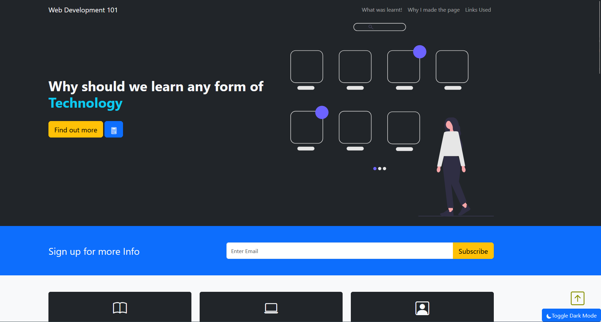
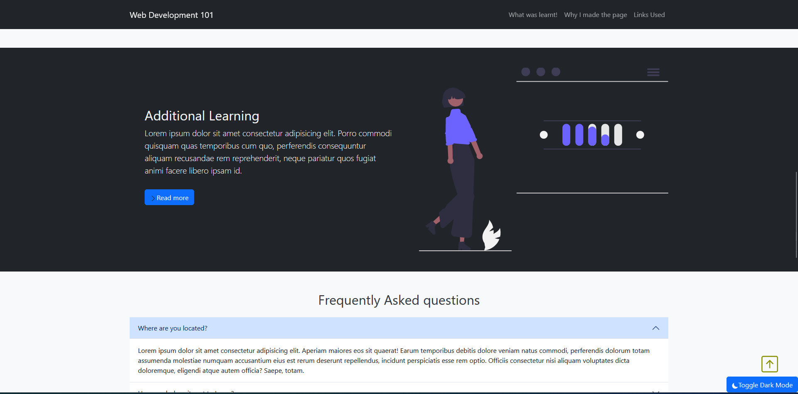
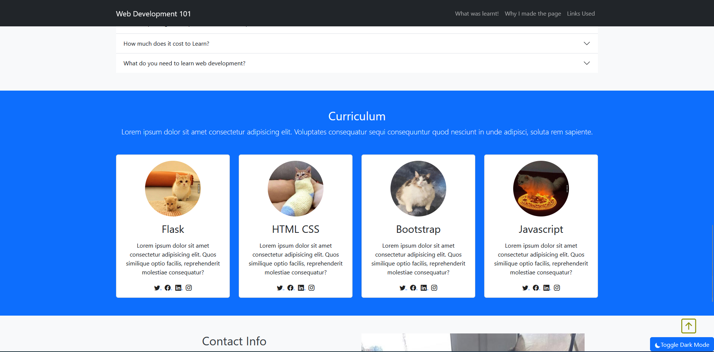
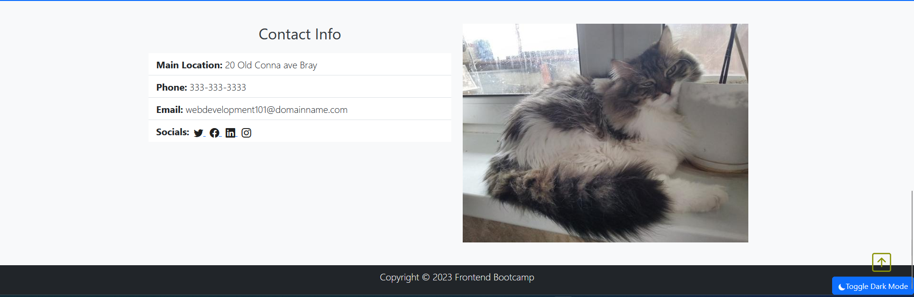
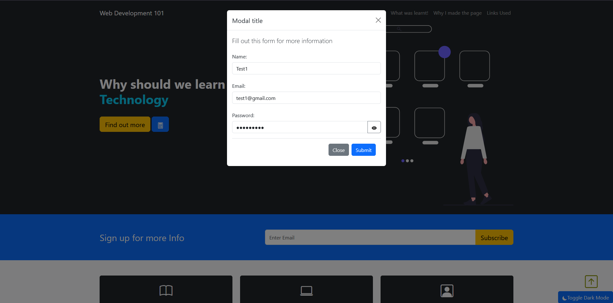
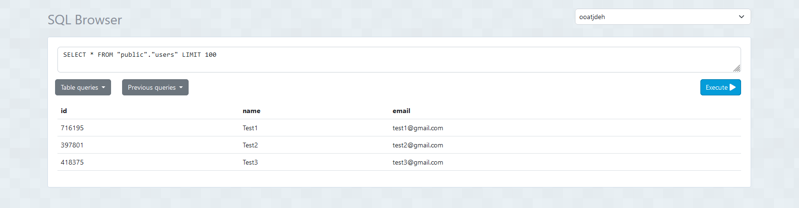
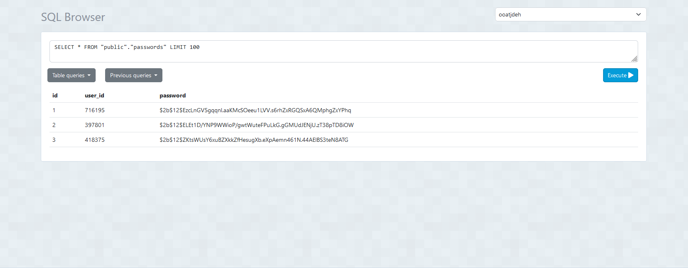

# FlaskApplication
Overview:
This a very basic Flask web application to futher enhance my learning of coding concepts.

It is a Flask Application made using Python, integrating a REST API, and connecting it to an database (ElephantSQL). 

The Flask web application allows users to toggle dark mode, scroll back to top button, and store user information (username, password, and email) in the cloud-based ElephantSQL database.

# Demo:
website interface:

 

ElephantSQL database storing user information:

# Creation:
1.Created Flask application and used CSS, Bootstrap, and HTML to design the front end of the website.

I used Flask rather than any other web framework due to Flask being a beginner-friendly framework for learning to create web applications with static pages.
The usage of the CSS framework Bootstrap allowed for easy customization of the site. 
I used CSS as well for easy implementation of Dark mode with JavaScript.
I created the front end as a base for the site's back end for easy visualization of what to implement in the back end.
I used these tools due to prior experience, their simplicity, and the easy creation of a quick prototype. 

2.Made back-end by implementing functions using JavaScript. 

I implemented JavaScript because it is commonly used for many modern websites and building user-interactive applications.
I used JavaScript to implement minimum password length, dark mode toggle, and user information input into the SQL database.

3.Integrated ElephantSQL with REST API to the code to allow storage of user information into tables after input into an HTML-made modal.

I used ElephantSQL with REST API because it is free and allows easy creation of a PostgreSQL database instance.
It made it so I could have a database without needing to set it up, as the focus of the project was to enhance my coding rather than on databases.
I made a modal using HTML as it seemed better looking and aesthetic than creating another webpage for user, password, and email input.

4.Implemented Salting and Hashing to keep passwords secure in ElephantSQL.

I used salting and hashing to keep user information private for extra safety with data protection.
Salting and Hashing allowed the password to be encrypted in the SQL database in case any breaches occurred in the database.
Both add extra layers of protection.

