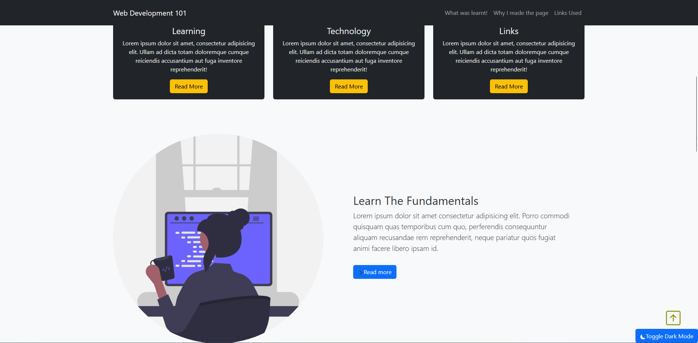

# FlaskApplication
Overview:
This a very basic Flask web application to futher enhance my learning of coding concepts.

It is a Flask Application made using Python, integrating a REST API, and connecting it to an database (ElephantSQL). 

The Flask web application allows users to toggle dark mode, scroll back to top button, and store user information (username, password, and email) in the cloud-based ElephantSQL database.

# Demo:
website interface:

 

ElephantSQL database storing user information:

# Creation:
1. Created Flask application and used CSS, bootstrap and HTML to design the front-end of the website.

Used Flask rather than any other web framework due to Flask being a beginner friendly framework to learn to create web applications with static pages.
Usage of CSS framework bootstrap allowed for easy customization of site. 
Used CSS as well for easy implementation of Dark mode with JavaScript.
Created front-end as a base for the back-end of the site for easy visualisation of what to implement in the back-end.
Used these tools due to prior experience, its simplicity and easy creation of a quick protype. 

2. Made back-end by implementing functions using JavaScript. 

Implemented JavaScript due to its nature of being commonly used for many modern websites and building user interactive applications.
The language has also the language used by web browsers enhancing my choice to use JavaScript in this project.
Used JavaScript to implement minimum password length, dark mode toggle, and input of user information to SQL database.

3. Integrated ElephantSQL with REST API to the code to allow storage of user information into tables after input into HTML made modal.

Used ElephantSQL with REST API due to it being free and allowing easy creation of a PostgreSQL database instance.
It made it so I could have a database without needing to set it up as the focus of the project was to enhance my coding than about databases.
Made modal using HTML as it seemed better looking and aesthetic than the creation of another webpage for user, password, and email input.

4. Implemented Salting and Hashing to keep passwords secure in ElephantSQL.

As extra safety with data protection, I had used salting and hashing to keep user information private.
Salting and Hashing allowed the password to be encrypted in the SQL database incase any breaches occured in the database.
Both add extra layers of protection.

